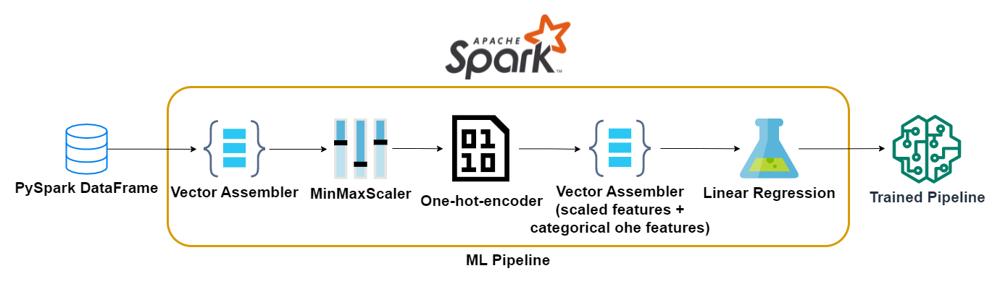
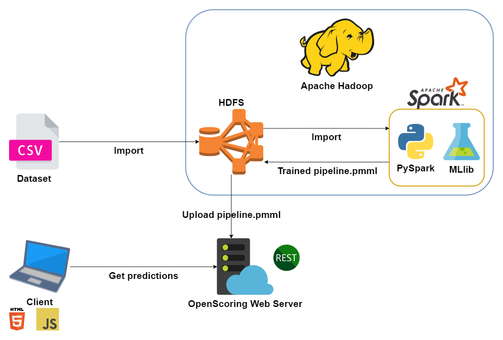

# PySpark-CarPricePrediction 
- Created a system that estimates used UK cars prices using Apache Hadoop and PySpark
- Imported on HDFS this [dataset](https://www.kaggle.com/kukuroo3/used-car-price-dataset-competition-format)
- Basic EDA 
- Developed using PySpark MLib a pipeline that execute the following tasks:
  - transforms features in a vectorized form
  - normalizes numerical features using a MinMaxScaler
  - builds a one-hot-vector for categorical features
  - trains a Linear Regression model
    
- The model achieved an R2 score of: ~0.87
- The model is exported in .pmml using pyspark2pmml library 
- Launch Openscoring server and upload the pmml model to it
- Developed a client interface (using HTML+Javascript+Bootstrap) to get predictions

  
# Prerequisites 
- Apache Hadoop (2.10.0)
- Apache Spark (3.0.1)
- PySpark (3.2.0)
- [OpenScoring](https://github.com/openscoring/openscoring)-server-jar (2.0.5)
- [Pyspark2pmml](https://github.com/jpmml/pyspark2pmml) (1.6.X)
# Usage
1. In ```PySpark/script/runSpark.sh``` set ```MY_PTH="your/path/to/PySpark-CarPricePrediction/PySpark" ``` 
2. Execute ```sh runProject.sh```   
3. Open ```Client/home.html``` and get car price


